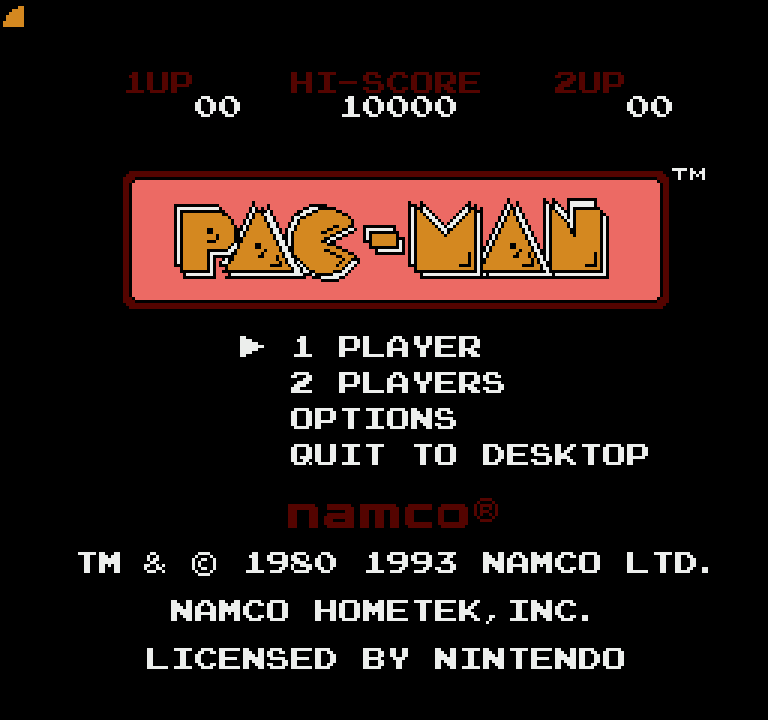
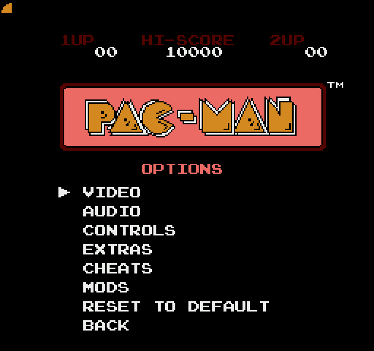
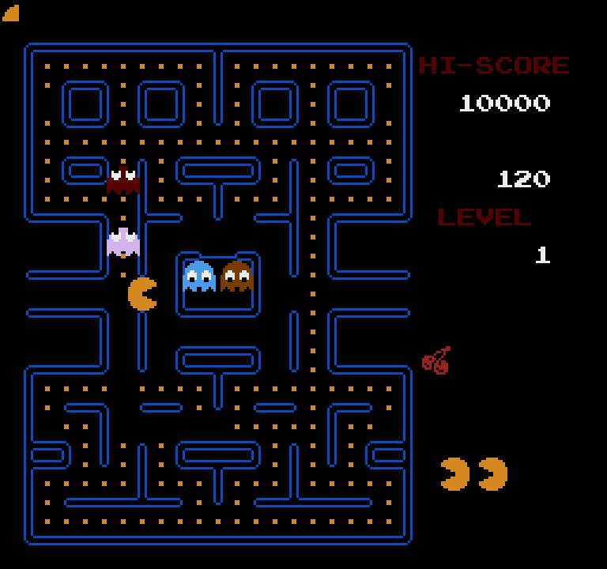
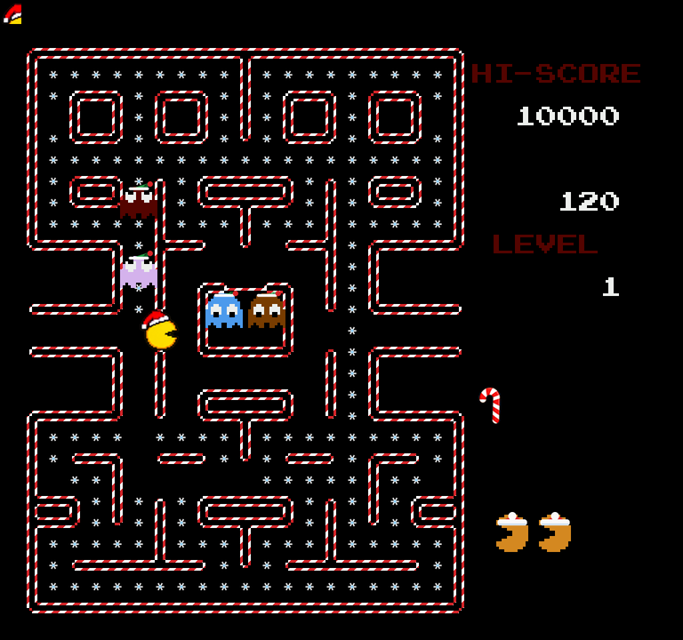
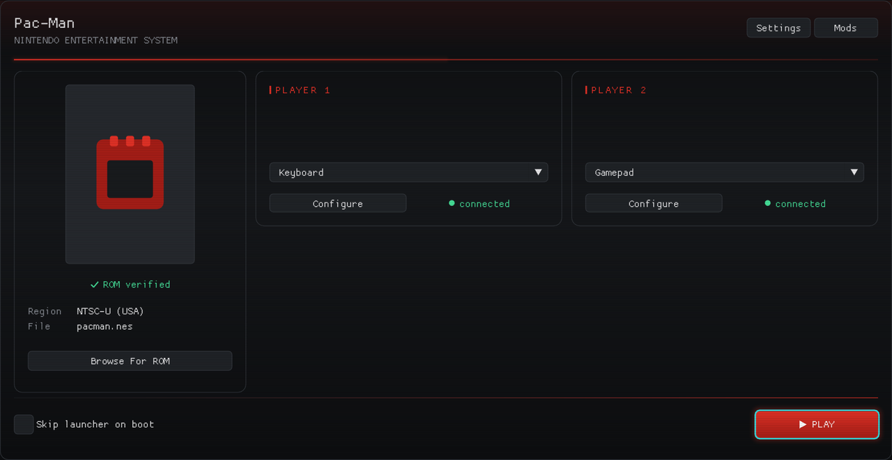
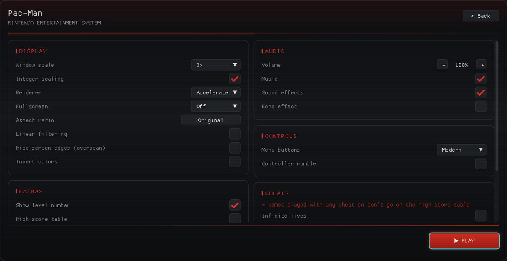
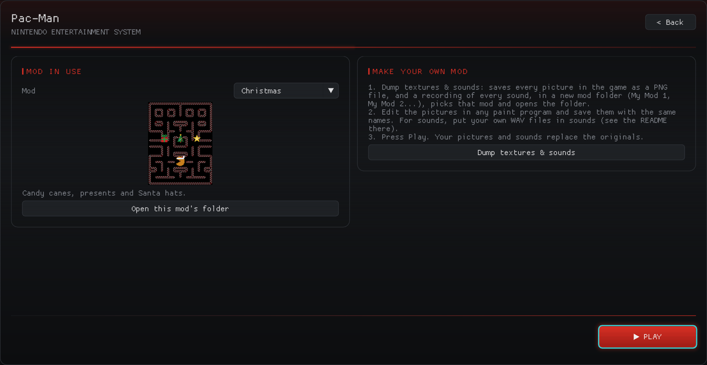

# PacManRecomp (Windows)

**For Windows 10 and 11 (64-bit).** There is no Mac or Linux version.

A native Windows version of **Pac-Man for the NES** (Namco, 1993), made by
static recompilation: the game's original 6502 code is translated into C and
compiled into a real Windows program, built with
[NESRecomp](https://github.com/mstan/nesrecomp). It plays exactly like the
cartridge, with a set of modern extras on top.

**No game files are included.** You need your own copy of the Pac-Man NES ROM.

| | |
|---|---|
|  |  |
|  |  |

\*Christmas mod not included



| | |
|---|---|
|  |  |

## Download & play (no programming needed)

1. Download **PacManRecomp-1.0.3-Windows-EasyBuild.zip** from
   [Releases](https://github.com/Mr-Shizzy/PacManRecomp/releases) and unzip it.
2. Put your own Pac-Man ROM (a `.nes` file) in the folder.
3. Double-click **Build Pac-Man.bat**. A window shows each step with progress
   bars (a few minutes; it downloads free build tools, and deletes them and
   its other temporary files when it's done).
4. Press **Play**, or open the **Pac-Man Recomp** folder and double-click
   **PacManRecomp.exe**.

Build on a normal internal drive (like C:) if you can: USB sticks and drives
formatted as exFAT are much slower with the thousands of small files the
build makes (15 minutes or more). You can move the finished **Pac-Man
Recomp** folder anywhere afterwards. The build needs about 2 GB of free space
while it works.

### Why you build it yourself

A recompiled game works by translating the cartridge's program into C and
compiling it into the `.exe`. So a finished `.exe` contains Pac-Man's own
game code, which belongs to Bandai Namco and can't be shared. To keep this
project legal, nothing of the game is ever distributed: the download holds
only the source code and a build script, and the game is made on your PC
from your own ROM. The Easy Build does all of that for you with one
double-click.

**"Other recomps give you a ready-made .exe. Why not this one?"** Many
projects do ship a finished `.exe` and ask you for your ROM. But the ROM
usually only supplies graphics and data: the game's code is already inside
that `.exe`, translated. Sharing it means sharing the publisher's code, and
those projects accept that risk. This project doesn't: building on your own
PC, from a ROM you own, is the safest way we know to do it. The cost is a
few minutes of waiting the first time (and for each update), and the
download of some free build tools.

(This is our understanding, not legal advice.)

## Features

### The game, untouched
- **Recompiled, not emulated.** The cartridge's own program runs as native
  code, so the gameplay, ghost behavior, timing, sound and the three
  intermissions are the real thing.
- **All 256 levels**, exactly as the cartridge plays them (no kill screen on
  the NES: after level 256 the game wraps back to level 1).
- **1 and 2 players**, each with their own keyboard or gamepad.

### Launcher
A front end that opens before the game, with every setting in one place:
video, audio, controls, game options, cheats and mods, each with a short
explanation when you hover over it. You can also skip it and go straight
into the game.

- **Optional updates:** tick **Check for updates on startup** (or press
  **Check for updates now**) on the launcher's main page. Off by default: the game never
  goes online unless you ask. When a new version is out, it asks first, then
  downloads it, builds it from your ROM and restarts the game, keeping your
  settings, keys, high scores and mods, and deleting what it downloaded.

### Video and audio
- Window size, fullscreen, integer scaling, smoothing filter, stretch to fill,
  hide the screen edges (overscan) and an inverse-colors mode.
- Volume, music and sound effects on/off separately, and an optional echo.

### Controls
- Keyboard or gamepad for each player, with keys you can rebind.
- **Controller rumble:** a soft buzz while the ghosts are blue, a jolt when
  you eat one, a rumble as Pac-Man dies, and a tiny blip for each dot. In
  2-player games only the player whose turn it is feels it.
- **Menu style:** the classic NES way (Select or Up/Down moves, Start picks) or modern
  (D-pad to move, A to pick, B to go back).

### In-game menus
- The title screen gets **Options** and **Quit to Desktop**: video, audio,
  controls, extras, cheats and mods, all without leaving the game.
- **Pause menu** (Esc): back to the main menu, to the launcher, or quit.

### Extras
- **Level number** in the score column.
- **High score table:** the top 10 with initials, saved between sessions,
  entered arcade-style when you make the list (1 and 2 players).

### Cheats
Infinite lives, start on any level from 1 to 256, Pac-Man speed (normal,
1.25x or 1.5x, ghosts unchanged) and invincibility. Games played with a cheat
on don't go on the high score table.

## Getting started

1. Build the game: with the Easy Build above, or from source (below).
2. Start `PacManRecomp.exe`. The launcher opens; pick your ROM.
3. Press **Play**.

Expected ROM: *Pac-Man (USA) (Namco)*, 24,592 bytes, CRC32 `9E4E9CC2`
(not counting the 16-byte iNES header).

### Default keys

| NES button | Player 1 | Player 2 |
|---|---|---|
| D-pad | Arrow keys | W A S D |
| A / B | Z / X | K / L |
| Select | `\` | Right Shift |
| Start | Enter | Right Ctrl |

Esc opens the pause menu. The launcher's **Controls** page shows the current
keys; change them in **Settings**, with **Configure** under each player.

## Building

You need Windows with these installed and on your PATH:
[CMake](https://cmake.org/) 3.20+, [Ninja](https://ninja-build.org/) and
[LLVM/clang](https://llvm.org/) (clang and clang++). Git Bash is handy for the
commands below and for the tests. SDL2 comes with NESRecomp; nothing else to
install.

Clone the three repositories side by side, with the two engine repos on the
`pacman-local` branch:

```bash
git clone -b pacman-local https://github.com/Mr-Shizzy/nesrecomp
git clone -b pacman-local https://github.com/Mr-Shizzy/recomp-ui
git clone https://github.com/Mr-Shizzy/PacManRecomp
```

Copy your ROM into the `PacManRecomp` folder and name it `pacman.nes`. Then,
from inside `PacManRecomp`:

```bash
# 1. Build the recompiler
cmake -S ../nesrecomp/recompiler -B ../nesrecomp/build/recompiler -G Ninja -DCMAKE_C_COMPILER=clang -DCMAKE_BUILD_TYPE=Release
cmake --build ../nesrecomp/build/recompiler

# 2. Translate your ROM into C (writes generated/; never shared)
../nesrecomp/build/recompiler/NESRecomp.exe pacman.nes --game game.toml

# 3. Build the game
cmake -S . -B build -G Ninja -DCMAKE_C_COMPILER=clang -DCMAKE_CXX_COMPILER=clang++ -DCMAKE_BUILD_TYPE=Release
cmake --build build
```

The game ends up in `build\PacManRecomp.exe` (with `SDL2.dll` next to it).

## Modding

Change how the game looks and sounds: repaint Pac-Man, the ghosts, the fruit,
the maze, the letters, the cutscenes and the title logo, at any
resolution, and replace any sound effect or the music. Several mods can be
installed at once; pick one in the launcher or in the game's MODS menu, which
shows each mod's preview picture, name, author and description.

### Made for beginners

Modding an NES game usually means working with its **tile sheet**: the
graphics are stored as hundreds of tiny 8x8-pixel pieces in four colors,
scattered across a sheet in whatever order the programmers needed. Pac-Man
alone is made of several pieces, and some pieces are shared between different
pictures or reused flipped. Emulator HD packs make it harder still: every
piece has to be listed in a text file with its tile number, palette and
conditions.

Here none of that is your problem:

- **One picture per thing, with a plain name.** Every graphic is its own PNG,
  whole and assembled: `pacman/closed.png`, `ghosts/blinky/up_1.png`,
  `fruit/cherry.png`, `font/A.png`, `maze.png`. Open it, paint it, save it.
- **One click to start.** In the launcher, **Mods > Dump textures & sounds**
  saves every picture of the game, 4x bigger and in its real colors, into a
  new mod folder, along with a recording of every sound so you can hear which
  one is which. It picks the new mod and opens its folder.
- **Paint in any program, at any size.** Paint, Krita, GIMP, Aseprite,
  Photoshop... Keep the picture's shape and the game scales it. Paint outside
  the original outline too (a hat, a cape) and it shows.
- **Mirrored pictures are spelled out.** The game draws Pac-Man going left and
  right from one picture, flipped. Those files are named `left+right_1.png`,
  so you know a hat painted there shows both ways. Want a different look for
  one side? Add `right_1.png` and it's used instead.
- **Shared and blank pieces are handled for you.** Where the cartridge reuses
  a piece in several pictures, the game works out which picture is on screen,
  so each of your files only ever changes itself.
- **The HD pack is built for you.** When you pick a mod, the game turns your
  folder of pictures into a full HD pack automatically. You never write a
  config file. (Existing Mesen HD packs work too.)
- **Sounds by name.** Drop `death.wav` or `siren.wav` into the mod's `sounds`
  folder to replace that sound, and add `music.wav` for background music
  during play. The game's timing never changes.
- **Optional extras** for when you want more: a different closed mouth for
  each direction, separate right-facing pictures, a custom title logo, and
  a `mod.txt` with your mod's name, author and description.
- **Share it as a folder.** A mod is just a folder: zip it to share it, unzip
  it into `mods` to install one. Before sharing, delete the pictures and the
  `sounds/originals` folder you didn't change: they're the game's own, and
  anything missing simply stays original for whoever plays your mod.

The full guide, with every file name and size, is in
[docs/MODDING.md](docs/MODDING.md).

## Tests

Headless input-script tests live in `tests/` (build the game first); see
[tests/README.md](tests/README.md).

## Credits

- [NESRecomp](https://github.com/mstan/nesrecomp) and
  [recomp-ui](https://github.com/mstan/recomp-ui) by Matthew Stanley (mstan):
  the recompiler, runtime and launcher this is built on.
- Pac-Man © Bandai Namco Entertainment. This is an unofficial fan project, not
  affiliated with or endorsed by Bandai Namco. No ROM, graphics or sound from
  the game is included.
- Developed with AI coding assistance; designed and play-tested by
  Mr-Shizzy.

## License

The code in this repository is MIT licensed (see [LICENSE](LICENSE)).
NESRecomp is under the PolyForm Noncommercial License 1.0.0, so builds of this
game may not be used commercially. recomp-ui is MIT licensed.
